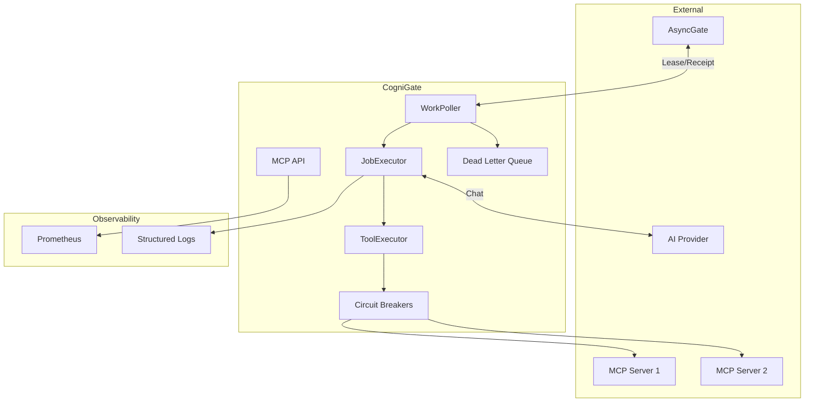
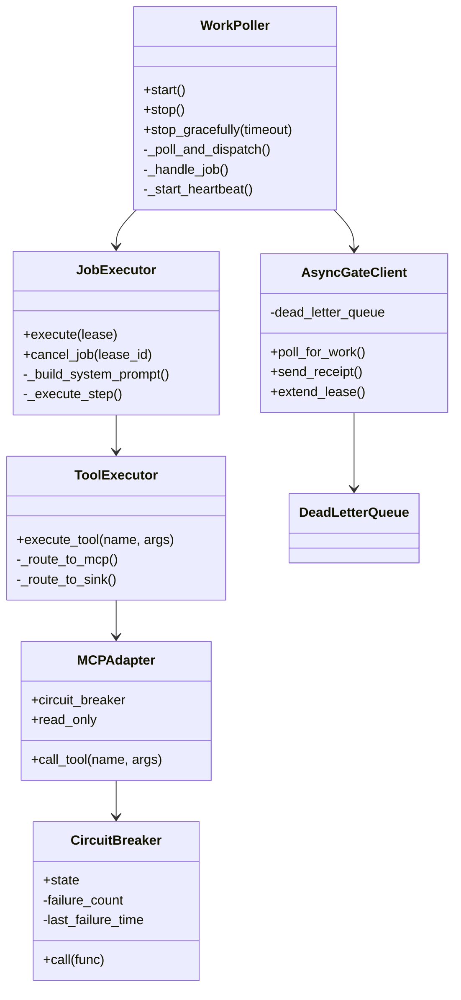
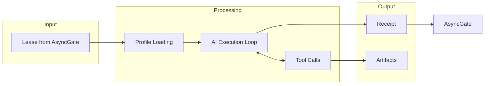

# CogniGate Architecture Diagrams

This directory contains Mermaid sequence and state diagrams documenting CogniGate's architecture and operational flows.

## Diagrams

### Core Flows

| Diagram | Description |
|---------|-------------|
| [Lease to Receipt Flow](lease-to-receipt-flow.md) | Complete job lifecycle from work claim to receipt delivery |
| [Planning Phase](planning-phase.md) | Instruction profile loading and system prompt construction |
| [Tool Invocation](tool-invocation.md) | MCP tool routing and execution with circuit breaker |

### Resilience Patterns

| Diagram | Description |
|---------|-------------|
| [Receipt Retry & DLQ](receipt-retry-dlq.md) | Receipt delivery with exponential backoff and dead letter queue |
| [Circuit Breaker States](circuit-breaker-states.md) | Circuit breaker state machine for external service protection |
| [Graceful Shutdown](graceful-shutdown.md) | Shutdown sequence ensuring job completion |

## Viewing Diagrams

These diagrams use [Mermaid](https://mermaid.js.org/) syntax. They can be viewed:

1. **GitHub/GitLab**: Renders Mermaid automatically in markdown
2. **VS Code**: Install "Markdown Preview Mermaid Support" extension
3. **Mermaid Live Editor**: https://mermaid.live/
4. **Documentation Sites**: Most modern doc tools support Mermaid

## System Overview

## Component Relationships

## Data Flow

