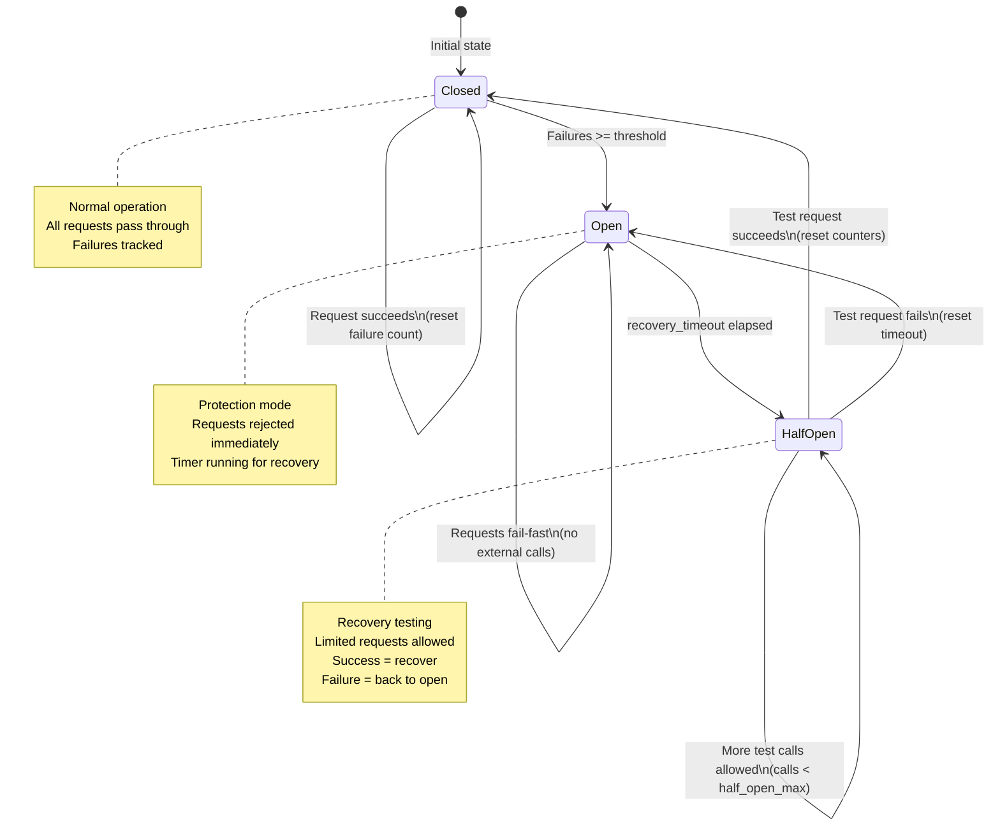
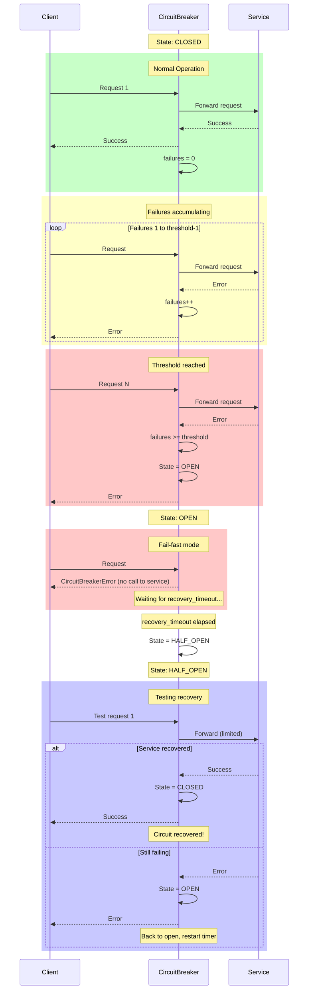
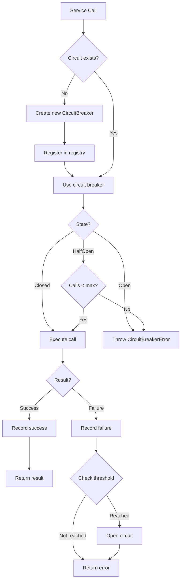
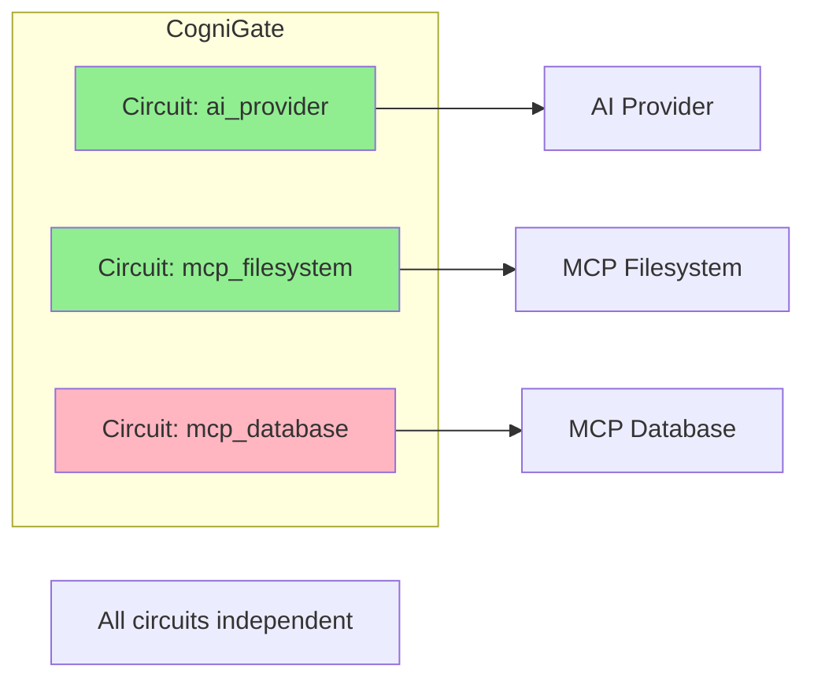

# Circuit Breaker State Transitions

This diagram shows the circuit breaker pattern implementation for external service protection.



## Detailed State Machine



## Configuration Parameters

| Parameter | Default | Description |
|-----------|---------|-------------|
| `failure_threshold` | 5 | Failures before opening circuit |
| `recovery_timeout` | 60.0s | Time to wait before half-open |
| `half_open_max_calls` | 3 | Test calls allowed in half-open |
| `excluded_exceptions` | None | Exceptions that don't count as failures |

## Circuit Breaker Registry



## Per-Service Circuit Breakers

CogniGate creates separate circuit breakers for:

| Service | Circuit Name | Purpose |
|---------|--------------|---------|
| AI Provider | `ai_provider` | Protect against AI API failures |
| MCP Server 1 | `mcp_<name>` | Isolate MCP endpoint failures |
| MCP Server 2 | `mcp_<name>` | Each MCP has its own circuit |



## Monitoring Metrics

```promql
# Current circuit breaker states
cognigate_circuit_breaker_state{name="ai_provider", state="closed"} 1
cognigate_circuit_breaker_state{name="ai_provider", state="open"} 0
cognigate_circuit_breaker_state{name="ai_provider", state="half_open"} 0

# Failure counts
cognigate_circuit_breaker_failures_total{name="ai_provider"} 12

# Alert query: Any circuit open
cognigate_circuit_breaker_state{state="open"} == 1
```
