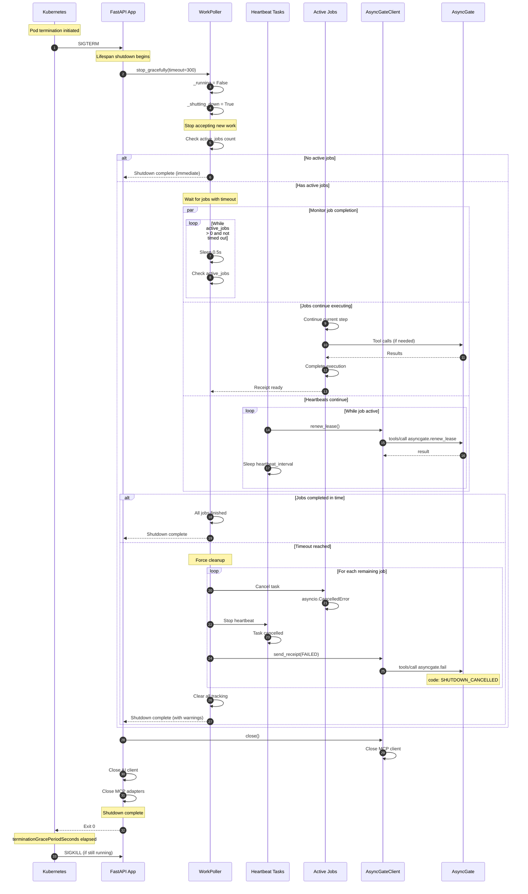
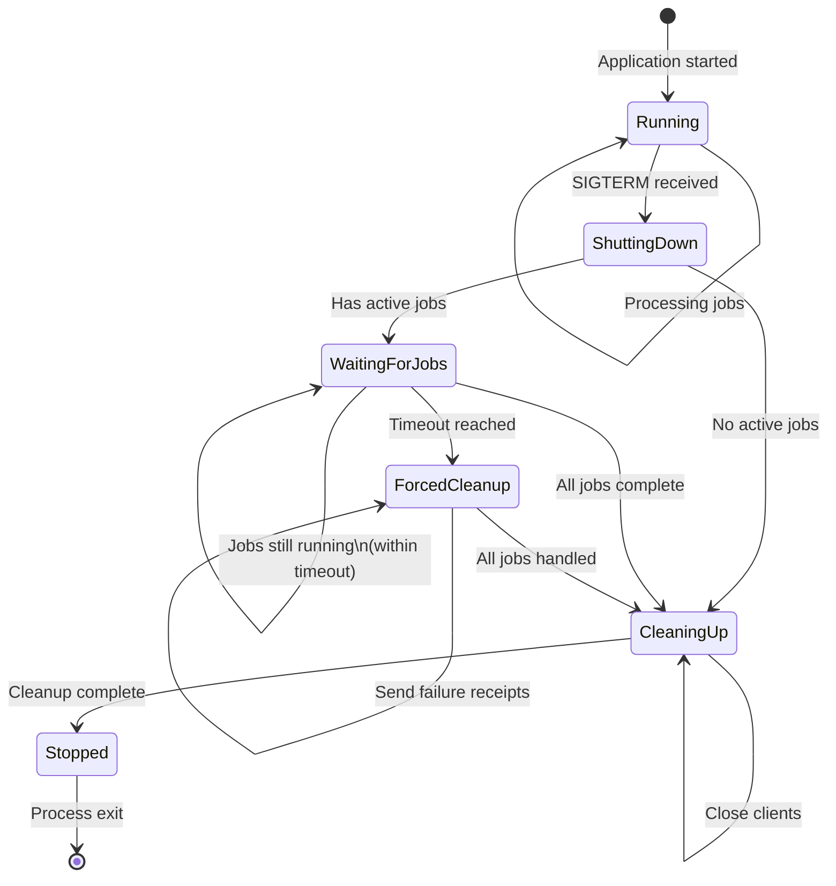
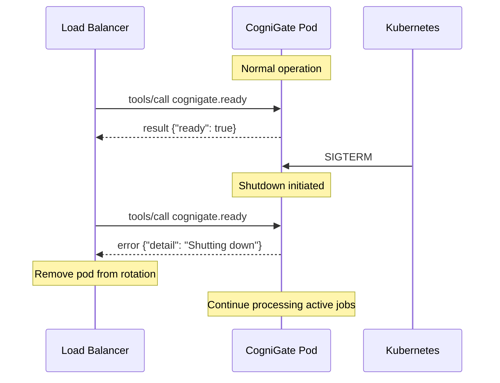

# Graceful Shutdown Sequence

This diagram shows how CogniGate handles graceful shutdown to ensure job completion.



## Kubernetes Configuration

```yaml
# deployment.yaml
spec:
  template:
    spec:
      # Total time allowed for graceful shutdown
      # Should be > job_timeout + buffer
      terminationGracePeriodSeconds: 330  # 5min + 30s

      containers:
        - name: cognigate
          lifecycle:
            preStop:
              exec:
                # Small delay to allow load balancer to drain
                command: ["/bin/sh", "-c", "sleep 5"]
```

## Shutdown State Diagram



## Timeline Example

```mermaid
gantt
    title Graceful Shutdown Timeline
    dateFormat ss
    axisFormat %S

    section Trigger
    SIGTERM received           :milestone, m1, 00, 0s

    section WorkPoller
    Stop accepting work        :a1, 00, 1s
    Wait for active jobs       :a2, after a1, 10s

    section Active Job
    Continue execution         :b1, 00, 8s
    Send completion receipt    :b2, after b1, 2s

    section Heartbeat
    Keep extending lease       :c1, 00, 8s
    Stop heartbeat            :c2, after b2, 1s

    section Cleanup
    Close HTTP clients         :d1, after a2, 2s
    Close MCP adapters         :d2, after d1, 1s
    Process exit              :milestone, m2, after d2, 0s
```



## Readiness Probe Behavior

During shutdown, the readiness probe returns 503:



## Configuration Parameters

| Parameter | Default | Description |
|-----------|---------|-------------|
| `graceful_timeout` | 300s | Max wait for jobs in shutdown |
| `terminationGracePeriodSeconds` | 330s | K8s hard limit (timeout + buffer) |
| `preStop.sleep` | 5s | Allow LB to drain connections |
| `heartbeat_interval` | 60s | Lease extension frequency |
