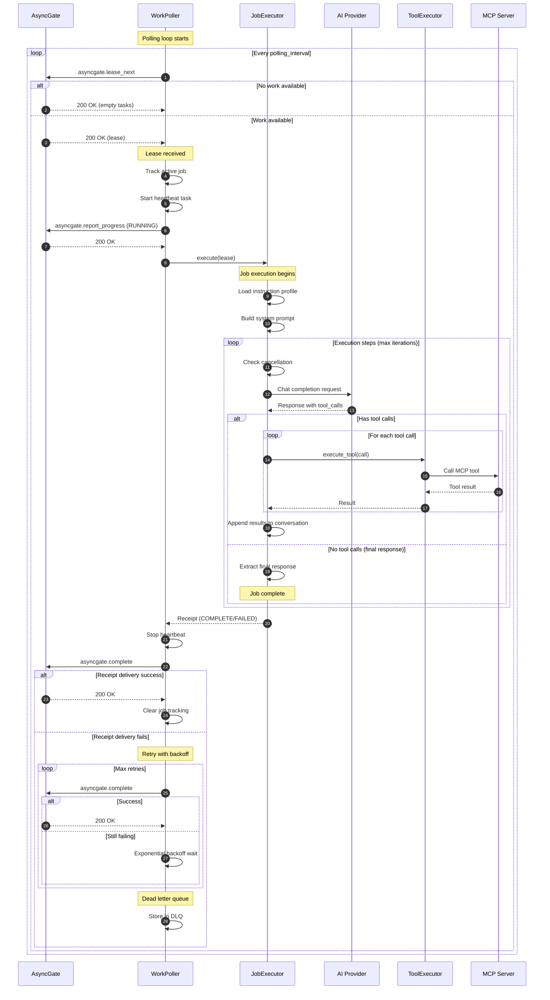

# Lease to Receipt Flow

This diagram shows the complete flow from work claim to receipt delivery.

## Key Points

1. **Polling**: WorkPoller continuously polls AsyncGate for available work
2. **Lease Tracking**: Active jobs are tracked for graceful shutdown support
3. **Heartbeat**: Background task extends lease during long-running jobs
4. **Execution**: JobExecutor handles the AI conversation loop
5. **Tool Calls**: ToolExecutor dispatches to MCP servers
6. **Receipt Delivery**: Retries with exponential backoff, falls back to DLQ
