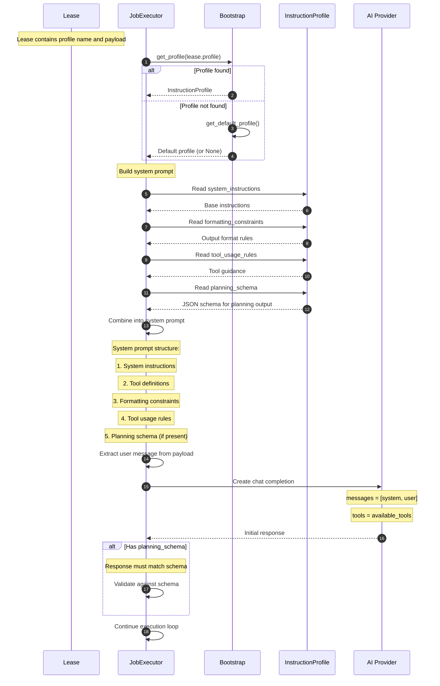
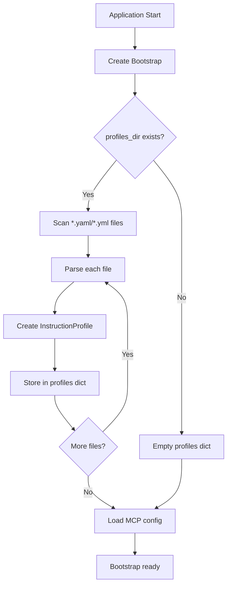

# Planning Phase

This diagram shows how CogniGate handles planning profiles and system prompt construction.



## Profile Configuration

Instruction profiles are YAML files in the profiles directory:

```yaml
# /etc/cognigate/profiles/analyst.yaml
name: analyst
system_instructions: |
  You are a data analyst assistant. Your role is to help
  users analyze data and generate insights.

formatting_constraints: |
  - Provide structured responses
  - Include confidence levels for conclusions
  - Cite data sources when applicable

tool_usage_rules: |
  - Prefer read-only operations
  - Validate inputs before tool calls
  - Explain tool results to the user

planning_schema:
  type: object
  properties:
    analysis_plan:
      type: array
      items:
        type: object
        properties:
          step: { type: string }
          tools_needed: { type: array, items: { type: string } }
          expected_output: { type: string }
    confidence: { type: number, minimum: 0, maximum: 1 }
  required: [analysis_plan]
```

## Bootstrap Loading


