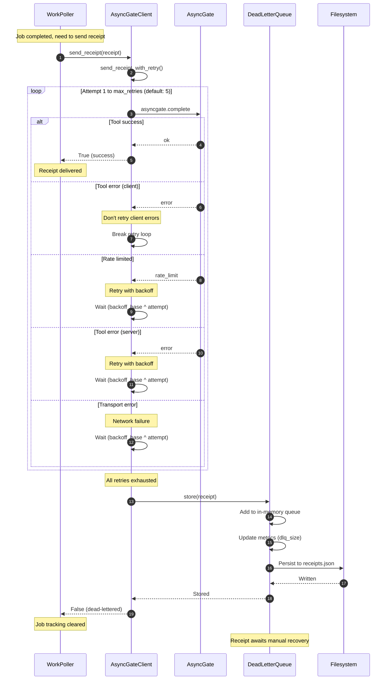
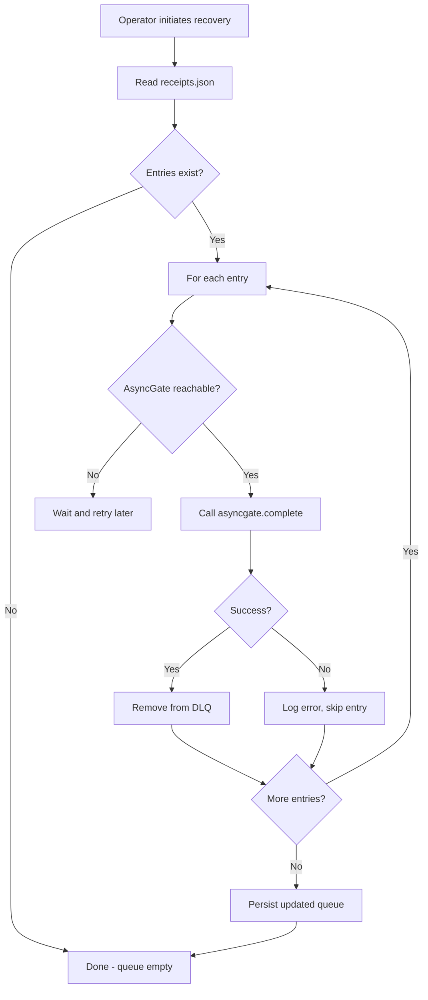

# Receipt Retry and Dead Letter Queue

This diagram shows the receipt delivery mechanism with retry logic and DLQ fallback.



## Backoff Timing

With default `backoff_base=2.0`:

| Attempt | Delay (seconds) |
|---------|-----------------|
| 1 | 0 (immediate) |
| 2 | 2 |
| 3 | 4 |
| 4 | 8 |
| 5 | 16 |
| **Total** | **~30s worst case** |

## DLQ Storage Format

```json
// /var/lib/cognigate/dlq/receipts.json
[
  {
    "receipt": {
      "lease_id": "abc-123",
      "task_id": "task-456",
      "worker_id": "cognigate-0",
      "status": "complete",
      "timestamp": "2024-01-15T10:30:00Z",
      "summary": "Task completed successfully",
      "artifact_pointers": ["s3://bucket/results.json"]
    },
    "failed_at": "2024-01-15T10:30:45Z",
    "attempts": 5
  }
]
```

## DLQ Recovery Flow



## Metrics

| Metric | Description |
|--------|-------------|
| `cognigate_receipts_total{status, success}` | Receipt send attempts |
| `cognigate_receipt_retries_total` | Number of retry attempts |
| `cognigate_dead_letter_queue_size` | Current DLQ size |
