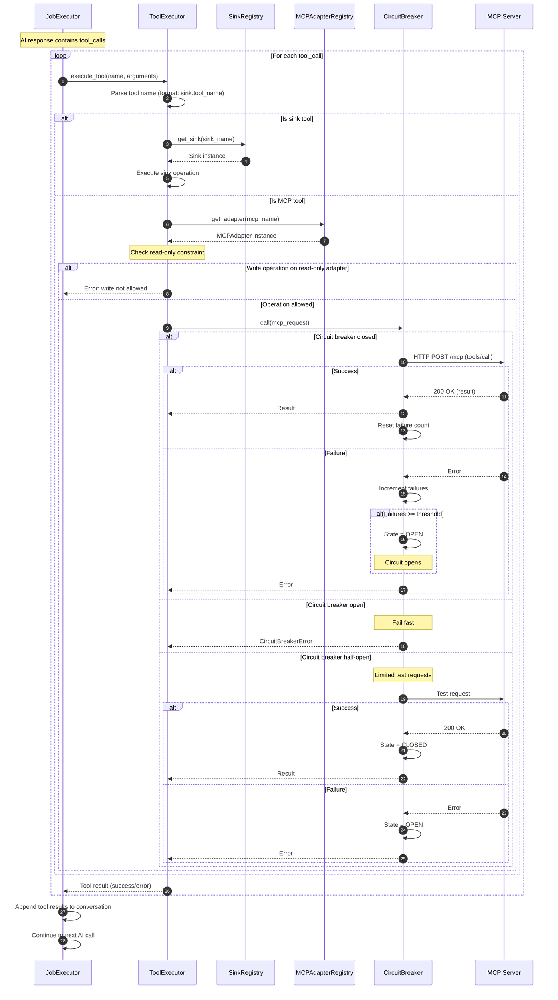
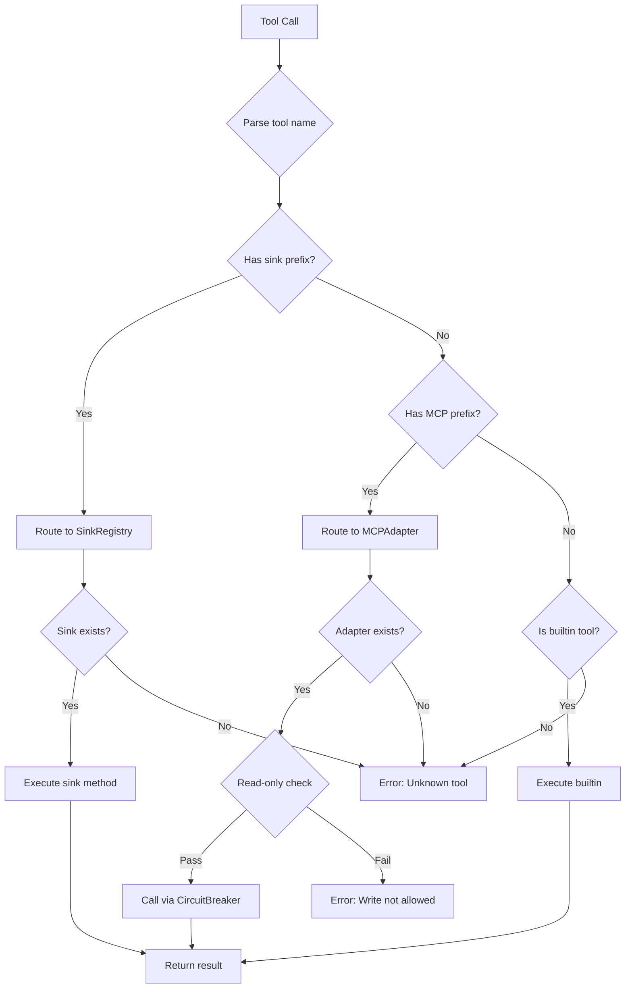
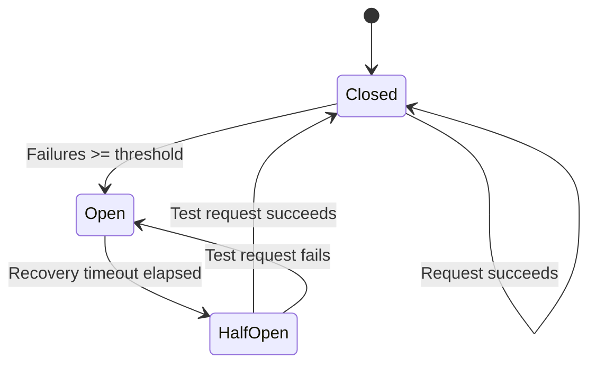

# Tool Invocation with MCP

This diagram shows how tool calls are routed through the MCP adapter system.



## Tool Routing Logic



## MCP Adapter Configuration

```yaml
# /etc/cognigate/mcp.yaml
mcp_endpoints:
  - name: filesystem
    endpoint: http://mcp-filesystem:8080
    auth_token: ${MCP_FS_TOKEN}
    read_only: true
    enabled: true

  - name: database
    endpoint: http://mcp-database:8080
    auth_token: ${MCP_DB_TOKEN}
    read_only: false  # Allow writes
    enabled: true

  - name: web
    endpoint: http://mcp-web:8080
    read_only: true
    enabled: true
```

## Circuit Breaker Per Adapter

Each MCP adapter has its own circuit breaker instance:


