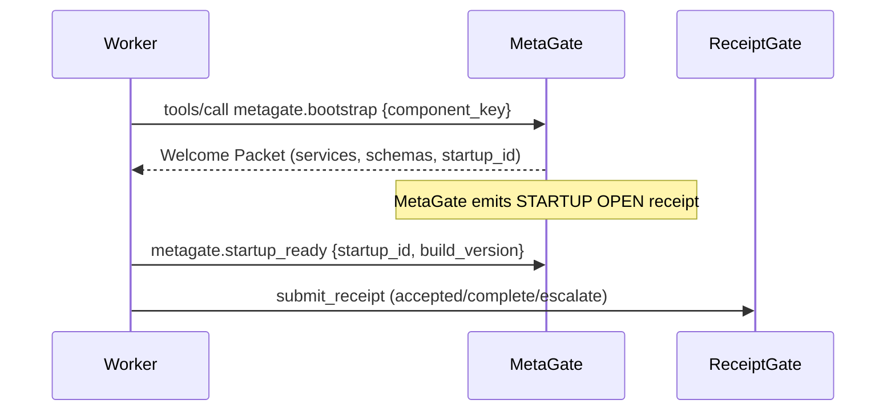

# LegiVellum Worker Contract (MCP Server) v0

Status: Draft (normative for problemata compatibility)  
Version: 0.1  
Last updated: 2026-01-31

This document defines the minimum contract a generic MCP worker MUST follow
to interoperate with LegiVellum problemata. A "worker" here is any MCP server
that executes work assigned by a Principal or DeleGate via AsyncGate or other
dispatch mechanism.

Normative keywords (MUST, SHOULD, MAY, etc.) follow RFC 2119 semantics.

---

## 1. Core Responsibilities

1) **Bootstrap from MetaGate**  
   The worker MUST request its resolved configuration from MetaGate at startup.

2) **Accept structured work**  
   The worker MUST accept a task envelope that includes identity, provenance,
   and routing configuration.

3) **Emit receipts**  
   The worker MUST emit `accepted` and `complete` receipts to ReceiptGate.
   If it cannot complete the work, it MUST emit `escalate`.

4) **Externalize artifacts**  
   Substantial outputs MUST be written to DepotGate and referenced by pointer
   in the completion receipt.

5) **Idempotency**  
   The worker MUST avoid duplicate side effects for the same `task_id` or
   `dedupe_key`.

6) **MCP-only transport**  
   The worker MUST expose an MCP interface for all interactions with LegiVellum
   primitives. Any HTTP endpoints are optional and MUST NOT be required for
   primitive-to-primitive communication.

---

## 2. Prohibitions (Hard Boundaries)

Workers MUST NOT:
- Mint new obligations (tasks/plans)  
- Route or schedule work for other workers  
- Maintain hidden long-term state unless explicitly allowed  
- Emit receipts without a valid task envelope

---

## 3. Required Inputs (Task Envelope)

Every task envelope MUST include:

- `task_id` (string)
- `tenant_id` (string)
- `principal_ai` (string)
- `payload_pointer` (string) **or** `inputs` (object)
- `constraints` (object)
- `provenance.parent_task_id` (string)
- `provenance.caused_by_receipt_id` (string)
- `provenance.dedupe_key` (string)
- `receipt_routing.endpoint` (string)
- `receipt_routing.auth_ref` (string or null)
- `receipt_routing.schema_version` (string)
- `artifact_routing.endpoint` (string)
- `artifact_routing.auth_ref` (string or null)

Recommended fields:
- `task_type`
- `expected_outcome_kind`
- `expected_artifact_mime`
- `time_budget_seconds`
- `tool_policy` (allowed tools, read/write)

---

## 4. Required Outputs

On receipt of work:
- Emit `accepted` receipt immediately (or as soon as responsibility is assumed)

On completion:
- Emit `complete` receipt with `status=success|failure|canceled`
- If output includes artifacts, include `artifact_pointer` + `artifact_location`

On inability to complete:
- Emit `escalate` receipt with a valid `escalation_class` and reason

---

## 5. Bootstrap Requirements

At startup, the worker MUST request a config package from MetaGate. The
package MUST include:

- Receipt routing (ReceiptGate endpoint + auth)
- Artifact routing (DepotGate endpoint + auth)
- Trust domain / tenant scope
- Receipt schema version
- Tool policy (if applicable)
- Timeouts, rate limits, and safety constraints

Workers MUST NOT start processing work until bootstrap succeeds.

---

## 6. Receipt Semantics

Receipts MUST conform to:
- `receipt.rules.md`
- `receipt.schema.v1.json`
- `receipt.store.md`

Routing invariant for escalation:
- `recipient_ai` MUST equal `escalation_to`

---

## 7. Receipt Error Decision Tree (Escalate vs Fail)

```mermaid
flowchart TD
  A[Error encountered] --> B{Can this worker complete within policy?}
  B -- yes --> C[Retry locally within budget]
  C --> D{Still failing?}
  D -- no --> E[Emit complete success]
  D -- yes --> F{Need new owner or capability?}
  F -- yes --> G[Emit escalate (recipient_ai == escalation_to)]
  F -- no --> H[Emit complete failure]
  B -- no --> F
```

Rules of thumb:
- Escalate for capability gaps, trust boundary failures, policy violations, scope mismatch, or when ownership must change.
- Fail when this worker is the correct owner but the task cannot be completed within policy.
- Escalation must target `recipient_ai == escalation_to`.

---

## 8. Idempotency Scenarios

Workers MUST enforce idempotency on `task_id` or `dedupe_key`:

- Same `receipt_id` + same receipt body -> return OK (idempotent replay).
- Same `receipt_id` + different body -> reject (conflict).
- Same `dedupe_key` -> do not re-execute side effects; return cached receipt.
- Duplicate `accepted` -> no-op (do not spawn duplicate execution).
- Duplicate `complete` -> no-op (do not re-write artifacts).

---

## 9. Bootstrap Sequence Diagram



---

## 10. Minimal Task Envelope (Example)

```json
{
  "task_id": "T-123",
  "tenant_id": "acme",
  "principal_ai": "agent.kee",
  "task_type": "summarize",
  "payload_pointer": "depotgate://payloads/plan-001",
  "inputs": {},
  "constraints": {
    "timeout_seconds": 300,
    "allowed_tools": ["mcp.call", "artifact.write"]
  },
  "provenance": {
    "parent_task_id": "NA",
    "caused_by_receipt_id": "NA",
    "dedupe_key": "lease-789"
  },
  "receipt_routing": {
    "endpoint": "https://receiptgate.internal/receipts",
    "auth_ref": "secrets/receiptgate_token",
    "schema_version": "1.0"
  },
  "artifact_routing": {
    "endpoint": "https://depotgate.internal",
    "auth_ref": "secrets/depotgate_token",
    "expected_mime": "application/json"
  }
}
```

---

## 11. Compliance Checklist (v0)

A worker is LegiVellum-compliant if it:

- [ ] Bootstraps from MetaGate  
- [ ] Accepts valid task envelope  
- [ ] Emits accepted/complete/escalate receipts  
- [ ] Writes artifacts to DepotGate  
- [ ] References artifacts by pointer in receipts  
- [ ] Honors idempotency (task_id/dedupe_key)

---

## 12. Compliance Test Scenarios

Minimal tests every worker should pass:

- Bootstrap succeeds; worker calls `metagate.startup_ready`.
- Missing required envelope field -> reject before execution.
- `accepted` -> `complete success` closes obligation.
- `accepted` -> `complete failure` closes obligation.
- Escalation sets `recipient_ai == escalation_to`.
- Duplicate receipt replay (same `receipt_id`) is idempotent.
- Duplicate `dedupe_key` does not re-run work.
- Artifact pointer in completion resolves to a staged DepotGate artifact.

---

## 13. Canonical References

See:
- `receipt.rules.md`
- `receipt.schema.v1.json`
- `receipt.store.md`

All documents are in `LegiVellum/docs/canonical/`.
